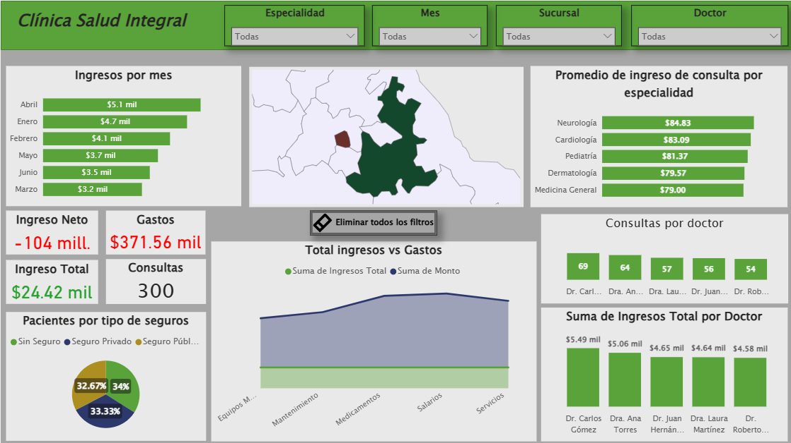
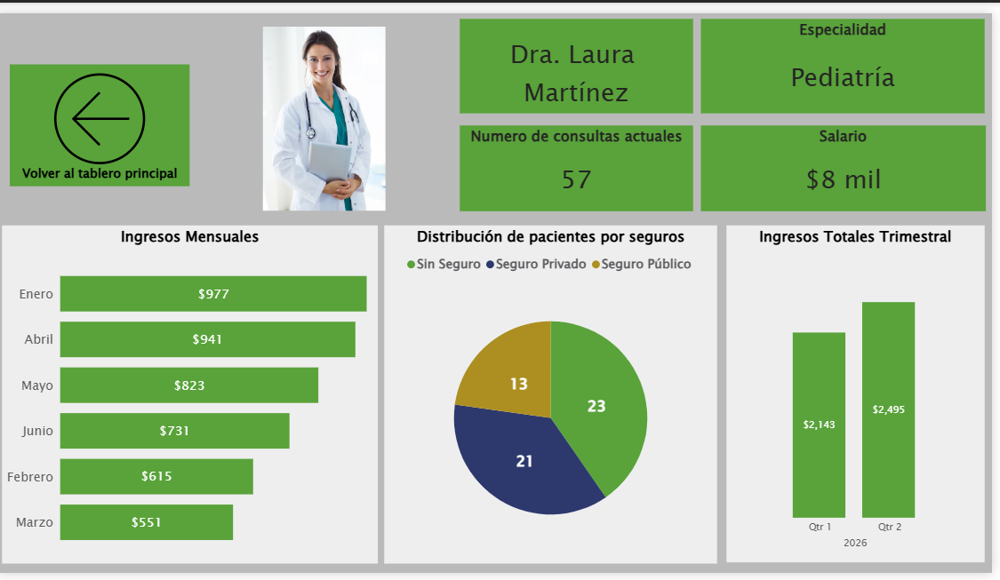

# 🏥 Clínica Salud Integral (CSI) — Dashboard Power BI

Dashboard de análisis operativo y financiero para una clínica médica con datos de consultas, ingresos, gastos y rendimiento por doctor.

---

## 📁 Archivos del proyecto

| Archivo | Descripción |
|---|---|
| `CSI.pbix` | Dashboard principal en Power BI |
| `Consultas_Clinica_Salud_Integral.xlsx` | Historial de consultas médicas |
| `Doctores_Clinica_Salud_Integral.xlsx` | Información del personal médico |
| `Gastos_Operativos_Clinica.xlsx` | Gastos operativos por sucursal |

---

## 🚀 Cómo abrir el dashboard

1. Instala **Power BI Desktop** desde [powerbi.microsoft.com](https://powerbi.microsoft.com/desktop)
2. Descarga todos los archivos y colócalos en la **misma carpeta**
3. Abre `CSI.pbix`
4. Si Power BI solicita redirigir los archivos Excel ve a **Inicio → Transformar datos → Configuración de origen de datos** y apunta a su ubicación actual
5. Haz clic en **Actualizar** para cargar los datos

---

## 🗺️ Cómo navegar el tablero

El dashboard tiene **dos páginas**:

**Página principal** — Muestra el resumen general de la clínica con ingresos, gastos, consultas por doctor y pacientes por tipo de seguro. Puedes filtrar por Especialidad, Mes, Sucursal y Doctor desde los menús desplegables de arriba.

**Página de detalles** — Muestra el perfil individual de cada doctor con sus ingresos mensuales, distribución de pacientes por seguro e ingresos trimestrales. Para acceder haz clic en cualquier doctor desde los gráficos del tablero principal.

---

## ⚠️ Nota
Los datos son ficticios y fueron generados con fines de práctica y análisis.
