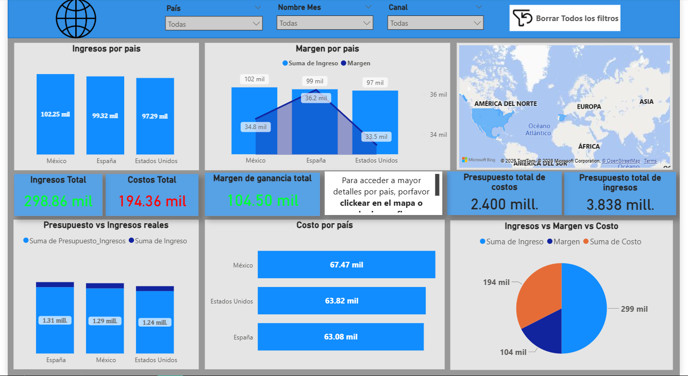
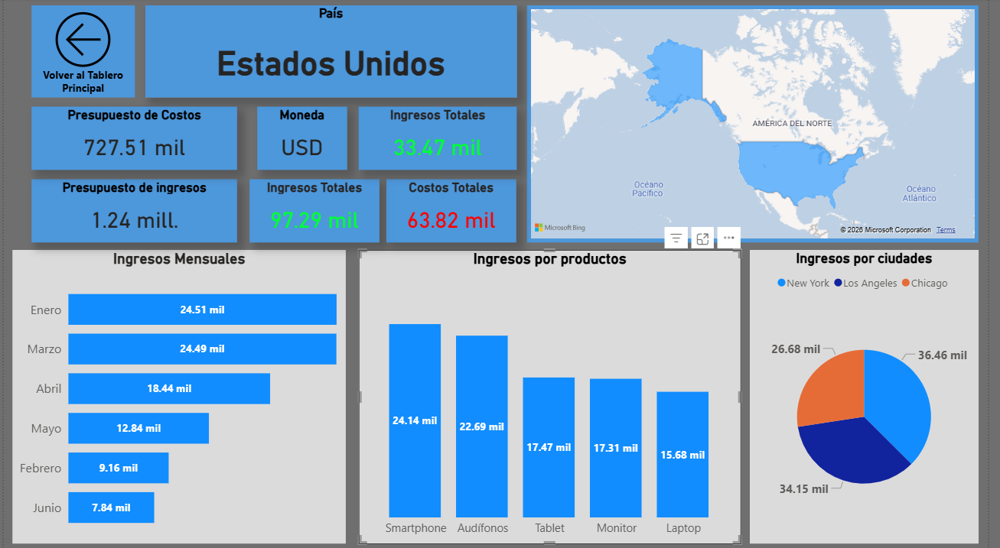

# 💹 Finanzas Globales — Dashboard Power BI

Dashboard de análisis financiero internacional con datos de ventas, costos, márgenes e ingresos por país, ciudad y canal de venta.

---

## 📁 Archivos del proyecto

| Archivo | Descripción |
|---|---|
| `FinanzasG.pbix` | Dashboard principal en Power BI |
| `Transacciones_Finanzas.xlsx` | Registro de transacciones e ingresos |
| `Presupuesto_Finanzas.xlsx` | Datos de presupuesto por país |
| `TipoCambio_Finanzas.xlsx` | Tipos de cambio por moneda |

---

## 🚀 Cómo abrir el dashboard

1. Instala **Power BI Desktop** desde [powerbi.microsoft.com](https://powerbi.microsoft.com/desktop)
2. Descarga todos los archivos y colócalos en la **misma carpeta**
3. Abre `FinanzasG.pbix`
4. Si Power BI solicita redirigir los archivos Excel ve a **Inicio → Transformar datos → Configuración de origen de datos** y apunta a su ubicación actual
5. Haz clic en **Actualizar** para cargar los datos

---

## 🗺️ Cómo navegar el tablero

El dashboard tiene **dos páginas**:

**Página principal** — Muestra el resumen general de todos los países con ingresos, costos, márgenes y presupuesto. Puedes filtrar por País, Mes y Canal desde los menús desplegables de arriba.

**Página de detalles** — Muestra información específica de cada país incluyendo ingresos mensuales, ingresos por producto e ingresos por ciudad. Para acceder haz clic directamente en el mapa o en las barras de un país.

---

## ⚠️ Nota
Los datos utilizados son ficticios y fueron generados con fines de práctica y aprendizaje.
